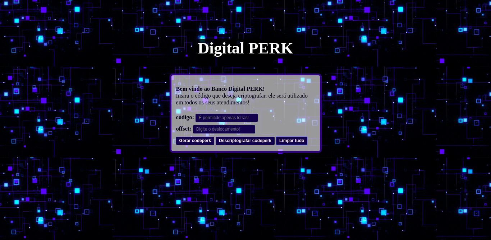

# Cifra de César

## Índice

* [1. Prefácio](#1-prefácio)
* [2. Resumo do projeto](#2-resumo-do-projeto)
* [3. Objetivos de aprendizagem](#3-objetivos-de-aprendizagem)
* [4. Considerações gerais](#4-considerações-gerais)
* [5. Interface do Usuário](#5-https://priscilassilveira.github.io/SAP005-cipher/src/index.html
)
* [6. Considerações técnicas](#7-considerações-técnicas)
* [7. Checklist](#9-checklist)

***

## 1. Prefácio

Cifrar significa codificar. A [cifra de
César](https://pt.wikipedia.org/wiki/Cifra_de_C%C3%A9sar) é um dos primeiros
tipos de criptografias conhecidas na história. O imperador romano Júlio César
utilizava essa cifra para enviar ordens secretas aos seus generais no campo de
batalha.


A cifra de César é uma das técnicas mais simples de cifrar uma mensagem. É um
tipo de cifra por substituição, em que cada letra do texto original é
substituida por outra que se encontra há um número fixo de posições
(deslocamento) mais a frente do mesmo alfabeto.

Por exemplo se usarmos o deslocamento (_offset_) de 3 posições:

* Alfabeto sem cifrar: A B C D E F G H I J K L M N O P Q R S T U V W X Y Z
* Alfabeto com cifra:  D E F G H I J K L M N O P Q R S T U V W X Y Z A B C
* A letra A será D
* A palavra CASA será FDVD

Atualmente todas as cifras de substituição alfabética simples, são decifradas
com facilidade e não oferecem muita segurança na comunição, mas a cifra de César
muitas vezes pode fazer parte de um sistema mais complexo de criptografia, como
a cifra de Vigenère, e tem aplicação no sistema ROT13.

## 2. Resumo do projeto

Muitas empresas fazem a verificação de dados pessoais por telefone, com a nova _Lei Geral de Proteção de Dados_, precisamos de uma nova maneira de autenticar os usuários. Pensando nisso, o **Digital Perk** desenvolveu o **Codeperk**, código que funciona como uma criptografia para atendimento ao cliente. O usuário insere a informação e ela será criptografada de acordo com a chave de deslocamento _(offset)_, recebendo em seguida o **Codeperk** , adquirindo mais segurança em seus atendimentos,
sem precisar informar seus dados pessoais.

## 3. Objetivos de aprendizagem

Neste projeto eu construi uma aplicação WEB que interage (_webApp_) que interage com o usuário final através do navegador utilizando HTML, CSS e
JavaScript como ferramentas.

### HTML e CSS

* [✔️] [Uso de HTML semântico.](https://developer.mozilla.org/pt-BR/docs/Glossario/Semantica#Sem%C3%A2ntica_em_HTML)
* [✔️] Uso de seletores de CSS.
* [✔️] Construir uma aplicação respeitando o desenho realizado (protótipo).

### DOM

* [✔️] Uso de seletores do DOM.
* [✔️] Manipular eventos do DOM.
* [✔️] [Manipulação dinâmica do DOM.](https://developer.mozilla.org/pt-BR/docs/DOM/Referencia_do_DOM/Introdu%C3%A7%C3%A3o)
(appendChild |createElement | createTextNode| innerHTML | textContent | etc.)

### JavaScript

* [✔️] Manipulação de strings.
* [✔️] Uso de condicionais (if-else | switch | operador ternário)
* [✔️] Uso de laços _(loops)_ (for | for..in | for..of | while)
* [✔️] Uso de funções (parâmetros | argumentos | valor de retorno)
* [✔️] Declaração correta de variáveis (const & let)

### Testing

* [✔️] [Teste unitário.](https://jestjs.io/docs/pt-BR/getting-started)

### Estrutura do código e guia de estilo

* [✔️] Organizar e dividir o código em módulos (Modularização)
* [✔️] Uso de identificadores descritivos (Nomenclatura | Semântica)
* [✔️] Uso de linter (ESLINT)

### Git e GitHub

* [✔️] Uso de comandos de git (add | commit | pull | status | push)
* [✔️] Gerenciamento de repositorios de GitHub (clone | fork | gh-pages)

## 4. Considerações gerais

* Este projeto foi desenvolvido individualmente.

## 5. Interface do Usuário
 Acesse a interface através do https://priscilassilveira.github.io/SAP005-cipher/src/index.html

O design do projeto é funcional, simples e intuitivo.



* paleta de cores escolhida:


### Interface do usuário (UI)

A interface permiti ao usuário:

* Eleger um _offset_ indicando quantas posições de deslocamento de caracteres
  quer que a cifra utilize.
* Inserir uma mensagem (texto) para ser cifrada.
* Ver o resultado da mensagem cifrada.
* Inserir uma mensagem (texto) para ser decifrada.
* Ver o resultado da mensagem decifrada.


## 6. Considerações técnicas

A lógica do projeto foi implementada inteiramente em JavaScript. Nesse
projeto **NÃO** foi feito o uso bibliotecas ou frameworks, só vanilla
JavaScript.


Os testes unitários cubriram o mínimo de 70% dos statements, functions e lines, e um mínimo de 50% de branches. O boilerplate já contem o setup e configurações necessárias para executar os testes assim como code coverage para ver o nível de cobertura dos testes usando o comando npm test.

O boilerplate inclui testes de exemplo, como ponto de partida.

O _boilerplate_ contém uma estrutura de arquivos como ponto de partida assim
como toda a configuração de dependências e testes de exemplo:

```text
./
├── .babelrc
├── .editorconfig
├── .eslintrc
├── .gitignore
├── README.md
├── package.json
├── src
│   ├── cipher.js
│   ├── index.html
│   ├── index.js
│   └── style.css
└── test
    ├── .eslintrc
    └── cipher.spec.js
```

O _boilerplate_ inclui tarefas que executam [eslint](https://eslint.org/) e
[htmlhint](https://github.com/yaniswang/HTMLHint) para verificar o `HTML` e
`JavaScript` com respeito a uma guia de estilos. Ambas tarefas são executadas
automaticamente antes de executar os testes quando usamos o comando `npm run
test`.

No caso do `JavaScript` estamos usando o `eslint` que está configurado no
arquivo `.eslintrc` que contem o mínimo de informação como versão do
JavaScript/ECMAScript, o ambiente (_browser_ nesse caso) e as [regras
recomendadas (`"eslint:recommended"`)](https://eslint.org/docs/rules/).

Nas regras/guias de estilo usaremos das recomandações padrão tanto para o
`eslint` quanto `htmlhint`.

***


## 7. Checklist
Ferramentas Utilizadas,
_**Vanilla JavaScript**,
**HTML**,
**CSS**._

### Este projeto compriu todas as etapas obrigatórias

* [✔️] `README.md` adicionar informação sobre o processo e decisões do desenho.
* [✔️] `README.md` explicar claramente quem são os usuários e as suas relações
  com o produto.
* [✔️] `README.md` explicar claramente como o produto soluciona os
  problemas/necessidades dos usuários.
* [✔️] Usar VanillaJS.
* [✔️] **Não** usar `this`.
* [✔️] Implementar `cipher.encode`.
* [✔️] Implementar `cipher.decode`.
* [✔️] Passar o linter com a configuração definida.
* [✔️] Passar as provas unitárias.
* [✔️] Testes unitários cubrindo 70% dos _statements_, _functions_ e _lines_, e
  no mínimo 50% das _branches_.
* [✔️] Interface que permita escolher o `offset` (chave de deslocamento) usava
  para cifrar/decifrar.
* [✔️] Interface que permita escrever um texto para ser cifrado.
* [✔️] Interface que mostre o resultado da cifra corretamente.
* [✔️] Interface que permita escrever um texto para ser decifrado.
* [✔️] Interface que mostre o resultado decifrado corretamente.
